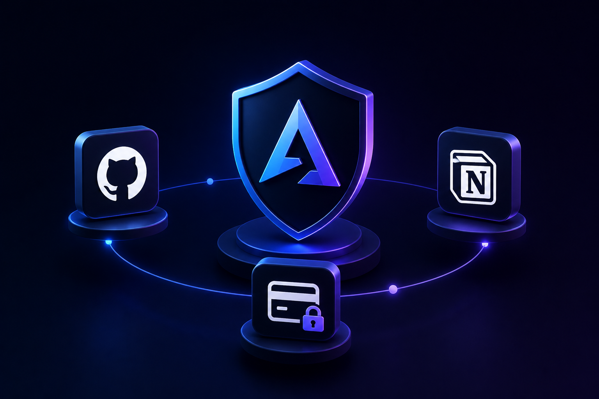
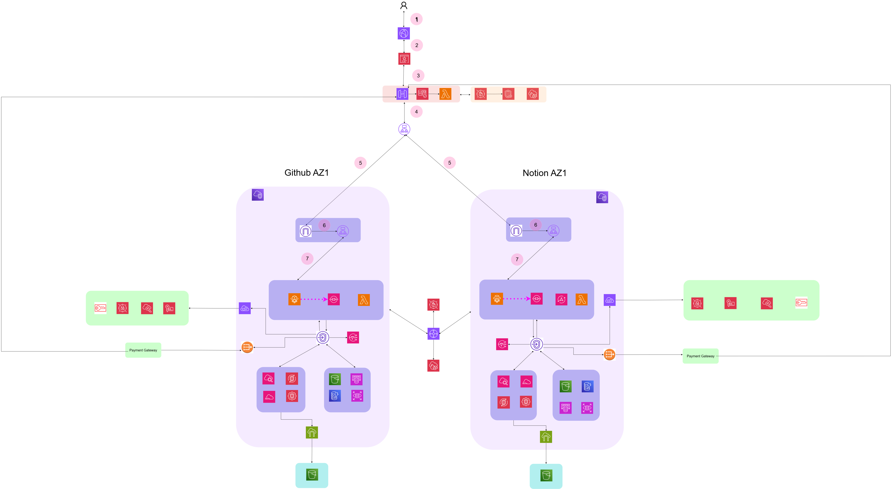

# 🔐 AegisSync — Secure Multi-AZ SaaS Architecture



> Secure, scalable SaaS backend integrating GitHub, Notion, and Payment Gateway on AWS

---

## 🧠 Overview

**AegisSync** is a **production-grade AWS architecture** designed for:

- Multi-AZ high availability  
- Secure third-party integrations  
- Hybrid (sync + async) processing  
- Scalable database design  

---

## ⚡ Key Highlights

- 🛡️ **Security-first** (IAM, KMS, Secrets Manager, PrivateLink)  
- ⚡ **Serverless scaling** (Lambda + SQS)  
- 🧩 **Hybrid architecture** (sync + async flows)  
- 🗄️ **RDS Multi-AZ + Read Replica**  
- 🌐 **Private VPC design (no public DB access)**  

---

## 🏗️ Architecture Diagram



---

## 🔄 System Flow

### 🟢 Critical Path (Synchronous)

- User → WAF → API Gateway → Lambda → RDS (Primary)

Used for:
- Authentication  
- Payments  
- Core operations  

---

### 🔵 Background Processing (Asynchronous)
- Lambda → SQS → Worker → GitHub / Notion APIs


Used for:
- Data sync  
- Event processing  
- High-volume tasks  

---

## 🗄️ Database Design

- **Primary DB (Multi-AZ)** → Writes + failover  
- **Read Replica** → Read scaling  

⚠️ Replica is eventually consistent → app handles read/write routing  

---

## 🔐 Security

- IAM least privilege  
- Secrets Manager (no hardcoded creds)  
- KMS encryption  
- WAF protection  
- Webhook signature validation  
- Private subnets + VPC endpoints  

---

## ⚙️ Tech Stack

- AWS Lambda  
- API Gateway  
- SQS  
- RDS (Multi-AZ + Replica)  
- S3  
- IAM, KMS, WAF  
- Terraform + Ansible  

---

## 🚀 Deployment

```bash
cd terraform
terraform init
terraform apply