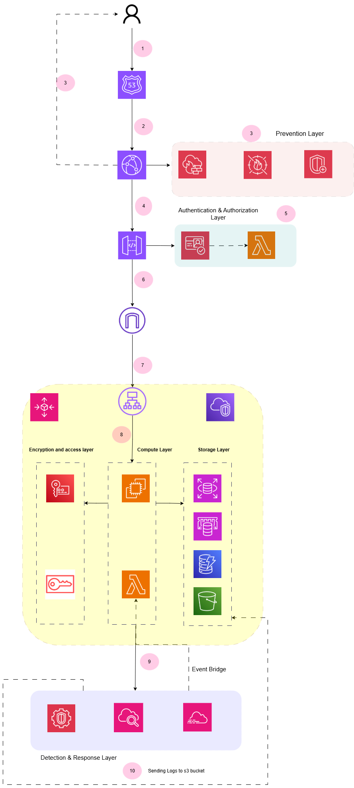

## 📊 Architecture Diagram

---

## 🔍 Request Flow Breakdown

This architecture enforces **layered security controls at every stage of the request lifecycle**:

### 1. User Entry

Traffic originates from the client and is routed via **Route 53**.

### 2. Edge Routing

Requests pass through **CloudFront (CDN)** for caching and global distribution.

### 3. 🛡️ Prevention Layer

Traffic is inspected and filtered using:

* AWS WAF → blocks SQL Injection & XSS
* AWS Shield → DDoS mitigation
* Rate limiting rules

### 4. API Layer

Requests are forwarded to **API Gateway**, acting as the controlled entry point.

### 5. 🔐 Authentication & Authorization

* AWS Cognito validates user identity
* IAM policies enforce least privilege access
* Only verified requests proceed

### 6. Private Compute Boundary

Traffic enters a **VPC-isolated environment** with no public exposure.

### 7. Compute Layer

* AWS Lambda executes business logic
* Fully serverless and event-driven

### 8. Data & Encryption Layer

* DynamoDB → transactional data (KMS encrypted)
* S3 → immutable audit logs (Object Lock - WORM)
* KMS → centralized encryption key management

### 9. Event & Monitoring Pipeline

* EventBridge captures system events
* Enables automation and decoupled workflows

### 10. 🚨 Detection & Response

* GuardDuty detects threats
* Automated Lambda responses mitigate risks
* Logs stored securely in S3

---

## 🧠 Why This Architecture Matters

* No direct exposure of compute or database layers
* Every request is verified, filtered, and logged
* Attack surface is minimized at multiple layers
* Real-time threat detection + automated mitigation

---

## 🎯 Threat Model (STRIDE)

| Threat | Mitigation |
|-------|-----------|
| SQL Injection | AWS WAF rules |
| DDoS | AWS Shield + CloudFront |
| Credential Theft | Cognito + MFA |
| Data Tampering | S3 Object Lock + KMS |
| Privilege Escalation | IAM Least Privilege |